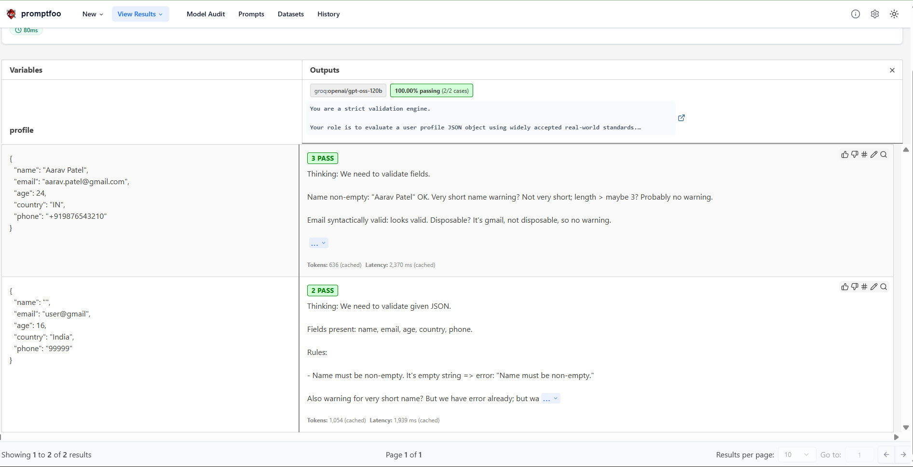

# LLM-Based User Profile Validator

This project uses a **Language Model (LLM)** to validate user profile JSON objects against real-world standards. It ensures fields like `name`, `email`, `age`, `country`, and `phone` are correctly formatted and provides warnings for soft validation issues.

The evaluation is automated using [Promptfoo](https://promptfoo.dev/), allowing deterministic test cases and assertions on LLM outputs.

---

## Repository Structure

```text
├── main.py                 # Core Python script for LLM-based input validation
├── input1.json             # Sample invalid / edge-case input data
├── input2.json             # Sample valid input data for testing
├── promptfooconfig.yaml    # Promptfoo evaluation configuration file
├── requirements.txt        # Python dependencies required to run the project
├── image.png               # Screenshot demonstrating output of promptfoo interface
├── .env                    # Environment variables (GROQ API key)*
├── .gitignore              # Git ignore rules for sensitive and unnecessary files
└── README.md               # Project documentation
```

## Features

- **Strict Validation:** Checks mandatory fields for correctness.  
- **Warnings:** Flags soft issues like unusually young age, short names, or disposable emails.  
- **JSON Output Contract:** Returns only valid JSON with `is_valid`, `errors`, and `warnings`.  
- **Python Script Support:** Run validation from `main.py`.  
- **Automated Testing:** Run test cases with Promptfoo.  

---

## Setup Instructions

1. **Clone the repository**
   ```bash
   git clone https://github.com/Om22210564/LLM-Based-Input-Validation
   cd LLM-Based-Input-Validation
   ```
   
2. **Install Python dependencies**
   For windows
   ```bash
   python -m venv venv          # windows
   venv\Scripts\activate        # Windows
   pip install -r requirements.txt
   ```
   For linux
   ```bash
   python3 -m venv venv 
   source venv/bin/activate     # Linux/macOS
   pip install -r requirements.txt
   ```

4. **Install Promptfoo**
   ```bash
   npx promptfoo@latest
   ```

5. **Set your GROQ API key using a `.env` file**
   ```bash
   GROQ_API_KEY="your_api_key_here"     
   ```
   

## How to Run the Python Script

The main.py script validates a JSON file and outputs the LLM-validated result.
```bash
python main.py input2.json #Windows
python3 main.py input2.json #Linux/MacOS
```
This command will evaluate all test cases defined in the tests section of promptfooconfig.yaml.

Example JSON input (input2.json):
```json
{
  "name": "Aarav Patel",
  "email": "aarav.patel@gmail.com",
  "age": 24,
  "country": "IN",
  "phone": "+919876543210"
}
```

Expected output:
```json
{
  "is_valid": true,
  "errors": [],
  "warnings": []
}
```

## How to Run Promptfoo Evals

Promptfoo evaluates the prompts against the test cases defined in promptfooconfig.yaml

Run all evals
```bash
npx promptfoo eval
```

View results
```bash
npx promptfoo view
```



## References

- [**Promptfoo Documentation**](https://www.promptfoo.dev/docs/intro/)
- [**Groq API Documentation**](https://console.groq.com/docs/overview).


This project is designed to be robust, deterministic, and easy to use, making it suitable for validating user data in real-world applications and automated testing pipelines.
